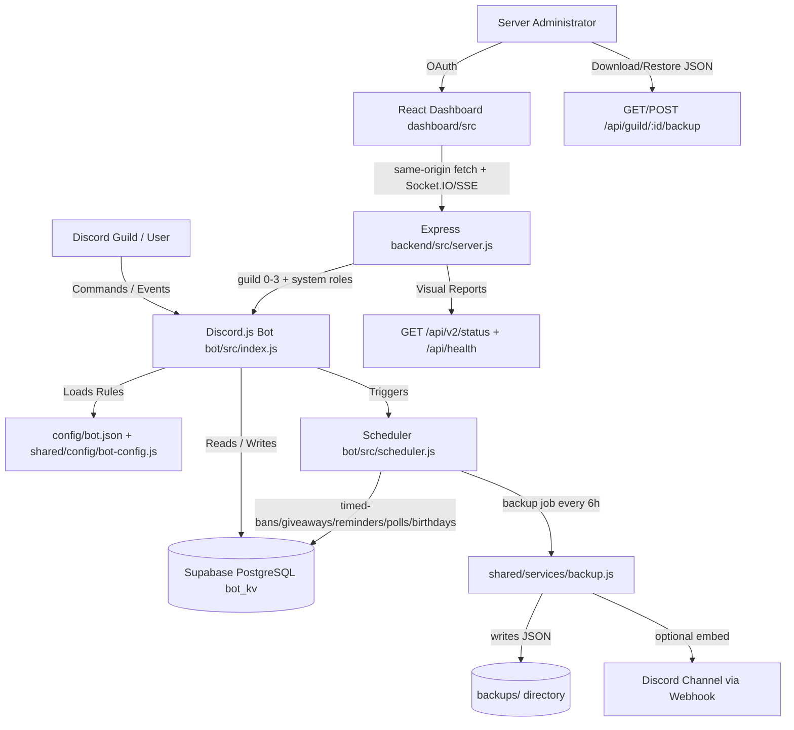

<div align="center">

# EB Bot V2 — بوت ديسكورد احترافي متكامل


    


بوت ديسكورد احترافي متكامل مصمم للإنتاج، يحتوي على لوحة تحكم ويب متجاوبة بـ 6 لغات، قاعدة بيانات Supabase PostgreSQL، حماية أمنية متعددة الطبقات، نسخ احتياطي تلقائي، نظام جدولة المهام، وأكثر من 100 أمر سلاش.


</div>


---


> [!IMPORTANT]
> **ملاحظة هامة:** تأكد من إعداد جميع المتغيرات في ملف `.env` بشكل صحيح وتفعيل صلاحيات الـ Gateway Intents كاملة في بوابة المطورين (Discord Developer Portal) قبل تشغيل البوت لتفادي أي أخطاء في الاتصال. الخادم يعمل على Node.js 22.12 LTS ويتطلب Supabase PostgreSQL.


---


## بنية وتدفق النظام (System Architecture)


يوضح المخطط البياني التالي التفاعل الديناميكي بين البوت، قاعدة البيانات، الجدولة، ولوحة تحكم الويب:





```text
Browser
  └─ React Dashboard V2
       ├─ Normal guild dashboard
       └─ Role-scoped Developer Control Center
            └─ Backend-only System Status UI
            │
            ▼
Express Backend
  ├─ OAuth/session authentication
  ├─ CSRF, rate limits, CSP, maintenance
  ├─ Guild membership/permissions/hierarchy
  ├─ System-role authorization
  ├─ Developer audit and metrics
  ├─ Socket.IO and SSE isolation
  └─ Sanitized errors/request IDs
            │
      ┌─────┴─────────┐
      ▼               ▼
Supabase          Discord
PostgreSQL        Gateway/REST/Voice
```


---


## المميزات الرئيسية والإنتاجية (Production Features)


- **⚙️ توحيد إعدادات البوت والتحكم المركزي ([config/bot.json](config/bot.json)):** حصر جميع متغيرات البوت، الألوان، مهدئات السبام، وخيارات الألعاب في ملف تهيئة رئيسي موحد موثق بـ JSON Schema مع محمل مركزي ([shared/config/bot-config.js](shared/config/bot-config.js)) يتحقق من الصحة ويعمل تجميد عميق للإعدادات.
- **🛡️ حماية الأوامر من السبام (Slash Commands Rate-Limiter):** تحديد سرعة تنفيذ الأوامر للأعضاء لمنع تعليق البوت أو حظره من قبل Discord API (مع استثناء المشرفين تلقائياً).
- **💾 النسخ الاحتياطي التلقائي وسحابة ديسكورد (Automated Backups):** نظام مدمج لجدولة نسخ الاحتياطية كل 6 ساعات محلياً في مجلد `backups/` مع إرسال إشعار تلقائي لقناتك الخاصة عبر Webhook.
- **📊 لوحة صحة البوت والخادم (Live Status Page):** واجهة ويب متطورة تفاعلية باللوحة لعرض استهلاك الرام، المعالج، الـ Uptime وحالة اتصال PostgreSQL ومخدمات الصوت.
- **🔍 فحص صارم لبيئة العمل قبل الإقلاع ([envValidator.js](shared/services/startup.js)):** إيقاف فوري للتشغيل وحظر الإقلاع في حال وجود أي نقص بمتغيرات ملف الـ `.env` لتجنب الأخطاء التشغيلية.
- **🌍 لوحة تحكم متعددة اللغات (Multilingual Dashboard):** واجهة ويب React 19 مع دعم 6 لغات (الإنجليزية، العربية، الألمانية، الفرنسية، الإسبانية، التركية) مع تبديل LTR/RTL.
- **🔐 نظام حماية متعدد الطبقات (Multi-Layer Security):** CSRF، rate limits، headers أمان، جلسات PostgreSQL دائمة، فحص صلاحيات Discord، وسجل تدقيق مطورين.
- **👥 نظام أدوار مزدوج (Dual Role System):** أدوار السيرفر (Member/Moderator/Admin) وأدوار النظام (SUPPORT/DEVELOPER/SUPER_ADMIN) منفصلة ومحصورة.


---


## قائمة الأقسام والأوامر


البوت يحتوي على **100 أمر سلاش** موزعة على الأقسام التالية:


| القسم | الأوامر | الوصف |
|:---|:---|:---|
| **الإدارة وال铪ظ** | `/ban`, `/softban`, `/kick`, `/timeout`, `/warn`, `/note`, `/lockdown` | معاقبة المخالفين وحماية السيرفر |
| **أتمتة المحتوى** | `/automod`, `/whitelist`, `/lock`, `/unlock`, `/slowmode` | حماية تلقائية من المحتوى الضار |
| **الأدوات** | `/help`, `/userinfo`, `/define`, `/math`, `/afk`, `/remind`, `/tools` | معلومات الأعضاء والأدوات المتنوعة |
| **الموسيقى** | `/play`, `/queue`, `/skip`, `/volume`, `/filters`, `/autoplay`, `/lyrics` | مشغل موسيقى متكامل مع فلاتر |
| **الألعاب** | `/fun`, `/games`, `/slots`, `/coinflip`, `/truthordare` | ألعاب تفاعلية ومتعة |
| **التذاكر** | `/ticket` (setup, claim, transcript, close) | نظام دعم فني وإدارة المساعدة |
| **التحقق** | `/setupverification` | حماية السيرفر من الروبوتات |
| **الأدوار** | `/reactionrole` | إهداء الأدوار بالتفاعل |
| **العيّد** | `/birthday`, `/birthdaysettings` | احتفال أعياد الميلاد |
| **التسجيل** | `/logging` | سجل أحداث السيرفر |
| **التفاعل** | `/rank`, `/leaderboard`, `/daily`, `/work`, `/pay`, `/points`, `/rep` | نظام النقاط والترقيات |
| **المجتمع** | `/suggest`, `/poll`, `/confess`, `/giveaway`, `/serverstats` | ميزات مجتمعية وتفاعل |


---


## متطلبات التشغيل والبدء السريع


1. **تثبيت الحزم المطلوبة:**


```bash
git clone https://github.com/EhabYT/Discord-v1.git
cd Discord-v1
cp .env.example .env
# قم بملء بيانات اعتماد Discord وعنوان Supabase PostgreSQL Session Pooler.
npm ci
npm start
```


`npm ci` يعمل `postinstall`، يتثبيت تبعيات لوحة التحكم، ويبني `dashboard/public` تلقائياً.


2. **أوامر التشغيل:**


```bash
npm start              # إنتاج: بوت + API + لوحة تحكم مبنية على :3000
npm run dev:fullstack  # تطوير: بوت (nodemon) + Vite HMR على :5173
npm run dev:backend    # API + لوحة تحكم مبنية فقط (بدون بوت)
npm run dev:frontend   # Vite HMR فقط
npm run build          # إعادة بناء dashboard/public
```


3. **توليد أسرار مستقلة:**


```bash
node -e "console.log(require('crypto').randomBytes(32).toString('hex'))"
```


لا تستخدم توكن البوت كـ `DEV_TOKEN` أو `SESSION_SECRET`.


---


## متغيرات البيئة (Environment Variables)


> [!CAUTION]
> لا ت从事 ` commits لملف `.env`. في Render، قم بتكوين القيم من لوحة Environment.

### متغيرات التشغيل المطلوبة


| المتغير | الغرض |
|:---|:---|
| `DISCORD_TOKEN` | توكن البوت المُدار |
| `CLIENT_ID` | معرف تطبيق Discord |
| `DATABASE_URL` | عنوان Supabase PostgreSQL Session Pooler الكامل |


### متطلبات OAuth


| المتغير | الغرض |
|:---|:---|
| `DISCORD_CLIENT_SECRET` | سر عميل Discord OAuth |
| `DISCORD_REDIRECT_URI` | عنوان الإرجاع المسجل بدقة |
| `DASHBOARD_URL` | مصدر لوحة التحكم العام |


### الإعدادات الموصى بها


| المتغير | الغرض |
|:---|:---|
| `SESSION_SECRET` | سر توقيع الجلسات المستقل |
| `OWNER_ID` | معرّف مستخدم Discord مع صلاحيات `SUPER_ADMIN` |
| `DEV_TOKEN` | عامل ثاني مستقل 32+ حرف للمطورين |
| `NODE_ENV=production` | سلوك الإنتاج والكوكيز الآمنة |
| `DASHBOARD_AUTH=true` | فرض Discord OAuth |
| `DASHBOARD_SECURE=true` | فرض كوكيز آمنة |


### إعدادات النظام والسجلات


| المتغير | الافتراضي | الغرض |
|:---|:---|:---|
| `DATABASE_POOL_SIZE` | `5` | حد اتصال PostgreSQL |
| `PORT` | المنصة | المنفذ الرئيسي |
| `DASHBOARD_PORT` | `3000` | المنفذ المحلي |
| `LOG_LEVEL` | `info` | `debug`، `info`، `warn`، أو `error` |
| `DEPLOY_COMMANDS` | `false` | نشر أوامر السلاش عند الإقلاع |


---


## نموذج الأمان (Security Model)


### عمليات السيرفر


```text
Session → Discord identity → Guild exists → Guild membership
→ Dashboard level → Discord hierarchy → Action
```


### مستويات لوحة التحكم


| المستوى | الاسم | الوصول |
|:---:|:---|:---|
| 0 | Viewer | عرض عام وإحصائيات وبيانات الأعضاء فقط |
| 1 | DJ | Viewer + أوامر الموسيقى على Discord |
| 2 | Moderator | DJ + الإدارة والعمليات المجتمعية |
| 3 | Admin | إعدادات السيرفر الكاملة والصلاحيات والنسخ الاحتياطي |


### عمليات النظام


```text
Session → Discord identity → Base system role
→ Optional second factor → Endpoint minimum role → Action → Audit event
```


```text
SUPER_ADMIN > DEVELOPER > SUPPORT > NONE
```


### الحماية المنصاتية


- CSRF origin/referer validation على الطلبات غير الآمنة
- OAuth state لمرة واحدة ومستقر الوقت
- تجديد الجلسة بعد تسجيل الدخول
- جلسات PostgreSQL دائمة
- حد حجم جسم الطلب 100 kB
- rate limits عامة و خاصة بالـ API
- Socket.IO rooms و SSE streams محصورة لكل سيرفر
- فحص Discord hierarchy للإجراءات المستهدفة
- أخطاء عميل مصفاة مع request IDs مرتبطة
- سجلات وتدقيق أسرار مصفاة بشكل تكراري
- Content Security Policy و HSTS وأعمدة الأمان
- تنظيف رشيق للبوت والـ HTTP والـ Socket.IO والـ SSE والجدولة وPostgreSQL والسجلات


---


## لوحة التحكم (Dashboard)


React 19 + Vite، تعمل على نفس مصدر الـ Express API.


### لوحة التحكم العادية


- نظرة عامة
- تحليلات ولوaderboards ونشاط مباشر
- الأعضاء والإدارة
- موسيقى (مطورين فقط)
- هدايا وتقدم
- تذاكر وأدوار تفاعلية
- أعياد ميلاد ومقترحات وتصويتات واعترافات
- لوحة طاقم العمل
- ترحيب وتحقق
- سجلات وأمان
- أوامر وإعدادات السيرفر
- تحكم البوت وصلاحيات لوحة التحكم
- مُنشئ التضمينات والاستجابات التلقائية (مالك فقط)


### لوحة تحكم المطورين


```text
/api/developer/*
```


| الميزة | SUPPORT | DEVELOPER | SUPER_ADMIN |
|:---|:---:|:---:|:---:|
| نظرة عامة على النظام | ✓ | ✓ | ✓ |
| مetadata الأوامر | ✓ | ✓ | ✓ |
| ملخص تشغيل السيرفر | ✓ | ✓ | ✓ |
| قراءة أعلام الميزات | ✓ | ✓ | ✓ |
| السجلات | — | ✓ | ✓ |
| مكتب الموسيقى | — | ✓ | ✓ |
| حالة المتغيرات | — | ✓ | ✓ |
| تشخيصات قاعدة البيانات | — | ✓ | ✓ |
| مقاييس الأداء | — | ✓ | ✓ |
| حالة مهام الجدولة | — | ✓ | ✓ |
| تشغيل/إيقاف/استئناف المهام | — | — | ✓ |
| سجل تدقيق المطور | — | ✓ | ✓ |
| تغيير وضع الصيانة | — | — | ✓ |
| نشر أوامر السلاش | — | — | ✓ |


---


## تكوين البوت (Bot Configuration)


`config/bot.json` خالٍ من الأسرار ومستخدم الإصدار 2:


```text
identity  - هوية البوت والنشاط الافتراضي
colors    - ألوان الـ embed المتاحة
emojis    - الإيموجي المدمجة
limits    - حدود التشغيل (تحذيرات، طابور، إléments)
automod   - كلمات الحماية التلقائية مع تطبيع Unicode
```


المحمل المركزي في `shared/config/bot-config.js` يتحقق من الصحة ويعمل تجميد عميق. جميع وحدات البوت تستهلك هذا المحمل بدلاً من استيراد JSON الخام.


---


## قاعدة البيانات (Database)


Supabase PostgreSQL تخزن جميع البيانات الدائمة.


### الجداول المنشأة تلقائياً


```text
bot_kv              - بيانات البوت الرئيسية (JSONB)
dashboard_sessions  - جلسات OAuth الدائمة
```


### ميزات قاعدة البيانات


- RLS مفعّل بدون سياسات متصفح
- prefix-heavy features تستخدم indexed keyset-paginated PostgreSQL scans
- developer key counts تستخدم SQL aggregates بدون نقل قيم JSONB
- advisory locks للمعاملات المتزامنة
- fallback إلى MemoryDatabase عند عدم توفر DATABASE_URL


### نقل SQLite القديم


```bash
npm run migrate:sqlite -- --source database/json.sqlite --dry-run
DATABASE_URL='postgresql://...' npm run migrate:sqlite -- --source database/json.sqlite
```


---


## الوضع التصحيحي (Maintenance Mode)


الصيانة تُفرض من الـ backend، ليست من أزرار مخفية.


```json
{
  "error": "رسالة الصيانة",
  "code": "MAINTENANCE",
  "until": 1787000000000
}
```


HTTP 503 مع `Retry-After` اختياري. health و OAuth و V2 و Developer APIs تبقى متاحة. `SUPER_ADMIN` يمكنه تكوين الرسالة ووقت النهاية التلقائي.


---


## الاختبار (Testing)


```bash
npm test                    # اختبارات الوحدة والأمان
npm run test:unit           # اختبارات الوحدة فقط
npm run test:security       # اختبارات الأمان فقط
npm run lint                # فحص التنسيق
npm run lint:gate           # فحص التنسيق مع الميزانية
npm run verify              # تحقق كامل
npm run build:dashboard     # بناء لوحة التحكم
```


### نطاق التحقق الحالي


- 100 أمر Discord
- Bot Config schema و AutoMod normalization
- 23 مجموعة اختبار أمان
- 185 route API
- OAuth و sessions و CSRF و guild isolation
- Discord hierarchy و privacy redaction
- Abuse و rate limits
- Economy/giveaway concurrency
- Error containment و graceful shutdown
- PostgreSQL و migration و session adapters
- Socket.IO/SSE guild isolation
- Developer role و direct API enforcement
- Audit metadata و recursive secret redaction
- Performance metrics
- Backend maintenance enforcement
- V2 readiness contract
- Dashboard production build


---


## النشر (Deployment)


### Render


`render.yaml` يعرّف:


```text
Build:  npm ci
Start:  npm start
Health: /api/health
Node:   22.12.0
```


الخدمة تبدأ قبل تشخيصات Discord حتى تحصل Render على منفذ مستمع دائماً. bootstrap البوت يعمل retry مع backoff أُسّي محدود.


```bash
# قبول النشر بدون بيانات اعتماد
npm run smoke:live -- --url https://your-service.onrender.com --allow-degraded --expect-release 2.0.0

# قبول نهائي
npm run smoke:live -- --url https://your-service.onrender.com --expect-release 2.0.0
```


### الإغلاق الرشيق


`SIGTERM` و `SIGINT` يوقف:


1. Bootstrap retry timer
2. Scheduler jobs
3. Discord client
4. SSE clients
5. Socket.IO
6. HTTP server
7. PostgreSQL pool
8. Logger streams


---


## دليل استكشاف الأخطاء وإصلاحها (Troubleshooting)


### `DATABASE_URL must start with postgresql://`


استخدم عنوان Supabase Session Pooler، ليس عنوان HTTPS للمشروع.


### البوت غير متصل


تحقق من `/api/v2/status`. كائن `botBootstrap` يقر حالة وعدد المحاولات وخطأ الأخير.


### OAuth معطّل


تحقق من `/api/auth/status`. تأكد من `CLIENT_ID` و `DISCORD_CLIENT_SECRET` و `DATABASE_URL`.


### `401 AUTH_REQUIRED`


سجّل الدخول عبر Discord OAuth.


### `403 SYSTEM_ROLE_REQUIRED`


مدير السيرفر ليس دور مطور. قم بتكوين `OWNER_ID` أو `DEVELOPER_IDS`.


### فشل التسلسل الهرمي


ضع دور البوت فوق الدور/العضو المستهدف.


---


## المجلدات الرئيسية (Key Directories)


```text
bot/src/                    أوامر Discord وأحداث Gateway والجدولة
backend/src/routes/         APIs HTTP
backend/src/middleware/     المصادقة والتفويض وCSRF والصيانة
backend/src/websocket/      Socket.IO مصادق عليه
backend/src/utils/          SSE
backend/src/metrics.js      مقاييس تشغيل محلية
dashboard/src/              عميل React V2
shared/config/              محمل Bot Config الموثق
shared/services/            خدمات النطاق المشتركة والتدقيق
database/                   محمل PostgreSQL والأقفال
scripts/                    نقل الأنفاق والتحويل
tests/                      اختبارات الوحدة والأمان واليدوية
config/                     تكوين البوت الخالٍ من الأسرار و JSON schema
docs/                       تدقيقات ودروس وتقارير الاختبار
```


---


## التوثيق (Documentation)


- [تدقيق V2 architecture و security](docs/v2-architecture-audit.md)
- [Phase 1 optimization audit](docs/optimization/phase1-optimization-audit.md)
- [Phase 2 indexed prefix-query optimization](docs/optimization/phase2-prefix-query-optimization.md)
- [تقرير اختبار V2 الكامل](docs/v2-test-report.md)
- [دروس الهندسة](docs/engineering-lessons.md)
- [مخطط Supabase](supabase/schema.sql)


---


<div align="center">
  <b>صنع بالكثير من القهوة بواسطة EB</b><br>
  <sup>جميع الحقوق محفوظة © 2026 EB Bot</sup>
</div>
