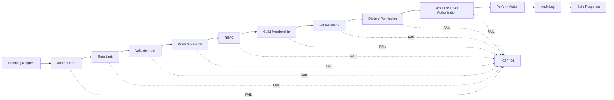

# Security Architecture

This document describes the security architecture of EB Bot, including trust boundaries, authentication/authorization flows, and defense-in-depth measures.

## Architecture Overview

```mermaid
flowchart TD
    %% =========================================================
    %% EXTERNAL / UNTRUSTED
    %% =========================================================

    User["Discord User / Guild Member"]
    Admin["Server Administrator"]
    Discord["Discord API"]

    User -->|"Commands / Events"| Discord
    Admin -->|"OAuth 2.0 Login"| OAuth["Discord OAuth 2.0"]

    %% =========================================================
    %% DISCORD BOT
    %% =========================================================

    subgraph BOT["Discord Bot — Trusted Runtime"]
        Bot["Discord.js Bot\nbot/src/index.js"]

        CommandGuard["Command Validation\nPermissions / Role Checks"]
        BotSecurity["Bot Security\nInput Validation\nAnti-abuse / Rate Limits"]
        BotConfig["Configuration Loader\nconfig/bot.json\nshared/config/bot-config.js"]

        Bot --> CommandGuard
        CommandGuard --> BotSecurity
        Bot --> BotConfig
    end

    Discord -->|"Gateway / Events"| Bot

    %% =========================================================
    %% DATABASE
    %% =========================================================

    subgraph DATA["Persistent Data Layer"]
        DBPool["Database Access Layer\nParameterized Queries"]
        PG[("Supabase PostgreSQL\nbot_kv")]
        DBBackup[("Encrypted Database Backups")]
    end

    Bot -->|"Validated DB Operations"| DBPool
    DBPool -->|"TLS / Least Privilege"| PG
    PG -->|"Backup"| DBBackup

    %% =========================================================
    %% SCHEDULER
    %% =========================================================

    subgraph SCHED["Scheduler"]
        Scheduler["Scheduler\nbot/src/scheduler.js"]
        JobGuard["Job Validation\nIdempotency / Locking"]
    end

    Bot -->|"Schedules Jobs"| Scheduler
    Scheduler --> JobGuard
    JobGuard -->|"Timed bans / giveaways\nreminders / polls / birthdays"| DBPool

    %% =========================================================
    %% BACKUP SYSTEM
    %% =========================================================

    subgraph BACKUP["Backup & Recovery"]
        BackupService["Backup Service\nshared/services/backup.js"]
        BackupStore[("Encrypted Backup Storage\nbackups/")]
        RestoreGuard["Restore Security\nAdmin Authorization\nValidation\nIntegrity Check"]
    end

    Scheduler -->|"Every 6h"| BackupService
    BackupService -->|"Encrypted JSON"| BackupStore
    BackupStore --> RestoreGuard
    RestoreGuard -->|"Controlled Restore"| DBPool

    %% =========================================================
    %% DISCORD WEBHOOK
    %% =========================================================

    Webhook["Discord Webhook\nRestricted / Secret URL"]

    BackupService -->|"Optional Backup Notification"| Webhook
    Webhook --> Discord

    %% =========================================================
    %% DASHBOARD
    %% =========================================================

    subgraph FRONTEND["Frontend — React Dashboard"]
        Dash["React Dashboard\ndashboard/src"]

        CSP["Browser Security\nCSP / Secure Headers"]
        FrontGuard["Frontend Route Guards"]
        Dash --> CSP
        CSP --> FrontGuard
    end

    Admin -->|"HTTPS"| Dash
    OAuth -->|"Authenticated Session"| Dash

    %% =========================================================
    %% API SECURITY
    %% =========================================================

    subgraph APISEC["Backend Security Boundary"]
        API["Express API\nbackend/src/server.js"]

        Helmet["Security Headers\nHelmet / CSP"]
        RateLimit["Rate Limiting\nAbuse Protection"]
        InputValidation["Schema Validation\nRequest Sanitization"]
        Session["Secure Session\nHttpOnly / Secure / SameSite"]
        RBAC["RBAC / Permission Enforcement"]
        GuildAccess["Guild Membership +\nBot Installation Checks"]
        Audit["Security Audit Log"]

        API --> Helmet
        Helmet --> RateLimit
        RateLimit --> InputValidation
        InputValidation --> Session
        Session --> RBAC
        RBAC --> GuildAccess
        GuildAccess --> Audit
    end

    Dash -->|"HTTPS / Same-Origin\nSocket.IO / SSE"| API

    %% =========================================================
    %% OAUTH
    %% =========================================================

    OAuth -->|"Authorization Code"| API
    API -->|"Validate OAuth Identity"| OAuth

    %% =========================================================
    %% API → BOT / DATA
    %% =========================================================

    API -->|"Authorized Guild Operations"| Bot
    API -->|"Status / Health"| Status["Read-Only Status\n/api/v2/status\n/api/health"]

    API -->|"Validated Queries"| DBPool

    %% =========================================================
    %% BACKUP API
    %% =========================================================

    BackupAPI["Backup API\n/api/guild/:id/backup"]

    Admin -->|"Authenticated Request"| BackupAPI
    BackupAPI --> API
    API -->|"RBAC + Guild Permission Check"| RestoreGuard

    %% =========================================================
    %% SECRETS
    %% =========================================================

    subgraph SECRETS["Secrets / Configuration"]
        Secrets["Environment Secrets\n.env / Secret Manager"]
        OAuthSecret["Discord OAuth Client Secret"]
        DBSecret["Database Credentials"]
        WebhookSecret["Webhook Secret"]
    end

    Secrets --> OAuthSecret
    Secrets --> DBSecret
    Secrets --> WebhookSecret

    OAuthSecret --> API
    DBSecret --> DBPool
    WebhookSecret --> Webhook

    %% =========================================================
    %% OBSERVABILITY
    %% =========================================================

    subgraph OBS["Monitoring & Security"]
        Logs["Structured Logs"]
        Metrics["Metrics / Health Monitoring"]
        Alerts["Security Alerts"]
    end

    Audit --> Logs
    BotSecurity --> Logs
    RateLimit --> Logs
    RestoreGuard --> Logs
    API --> Metrics
    Bot --> Metrics
    Logs --> Alerts

    %% =========================================================
    %% TRUST BOUNDARIES
    %% =========================================================

    User -.->|"UNTRUSTED INPUT"| BotSecurity
    Admin -.->|"UNTRUSTED CLIENT"| Dash
    Dash -.->|"UNTRUSTED REQUEST"| API
    API -.->|"TRUST BOUNDARY"| DBPool
    API -.->|"TRUST BOUNDARY"| Bot
```



## Security Flow



> **Key principle**: Authentication happens before authorization, and authorization happens before any privileged operation. Every denied request is logged for audit.

## Security Improvements

The key improvement in this architecture is that **security is no longer treated as one component**. Each boundary enforces its own controls:

### Discord → Bot
- Permission checks
- Role hierarchy validation
- Input validation
- Anti-abuse/rate limiting
- No trust in client-provided guild/user IDs

### Dashboard → Backend
- HTTPS
- Secure sessions (HttpOnly, Secure, SameSite)
- CSRF protection
- Rate limiting
- Request schema validation
- Security headers/CSP

### Backend → Guild
- Verify the user actually belongs to the guild
- Verify the bot is installed in the guild
- Verify the user has the required Discord permission
- Verify role hierarchy
- Never rely only on frontend permissions

### Backend → Database
- Parameterized queries
- Least-privilege database credentials
- TLS
- No credentials in source code
- No arbitrary table/query access from API requests

### Backup → Restore
- Admin authorization
- Guild ownership/permission verification
- JSON/schema validation
- Integrity checking
- Prevent path traversal
- Prevent arbitrary file restoration
- Audit every restore operation

## Security Controls by Boundary

### Discord → Bot

| Control | Implementation | Location |
|---------|---------------|----------|
| Permission Checks | Discord native permissions | `bot/src/guards/command-guard.js` |
| Role Hierarchy Validation | Target must be below actor | `bot/src/guards/command-guard.js` |
| Input Validation | String, snowflake, duration validators | `bot/src/guards/command-guard.js` |
| Anti-Abuse / Rate Limits | Per-user, per-guild, per-command | `bot/src/guards/command-guard.js` |
| No Client Trust | Guild/user IDs validated server-side | `bot/src/guards/command-guard.js` |

### Dashboard → Backend

| Control | Implementation | Location |
|---------|---------------|----------|
| HTTPS | Enforced in production | `backend/src/server.js` |
| Secure Sessions | HttpOnly, Secure, SameSite=Lax | `backend/src/server.js` |
| CSRF Protection | Origin/Referer validation | `backend/src/middleware/csrf.js` |
| Rate Limiting | Global + per-endpoint | `backend/src/middleware/rate-limit.js` |
| Request Validation | Schema validation middleware | `backend/src/middleware/validate.js` |
| Security Headers | Helmet.js CSP/HSTS | `backend/src/server.js` |

### Backend → Guild

| Control | Implementation | Location |
|---------|---------------|----------|
| Guild Membership | OAuth list + gateway fallback | `backend/src/middleware/guild-access.js` |
| Bot Installation | Bot in guild verification | `backend/src/middleware/guild-access.js` |
| Discord Permission | Role-to-level mapping | `backend/src/middleware/permissions.js` |
| Role Hierarchy | Discord role position checks | `backend/src/middleware/guild-access.js` |
| Never Frontend-Only | All checks server-side | `backend/src/middleware/guild-access.js` |

### Backend → Database

| Control | Implementation | Location |
|---------|---------------|----------|
| Parameterized Queries | `$1, $2...` placeholders | `database/index.js` |
| Least Privilege | Separate credentials per role | Environment config |
| TLS | Encrypted connection | `DATABASE_URL` config |
| No Credentials in Code | Environment variables only | `.env` / Secret Manager |
| No Arbitrary Access | Key-prefix isolation | `database/index.js` |

### Backup → Restore

| Control | Implementation | Location |
|---------|---------------|----------|
| Admin Authorization | Require level 3 (Admin) | `backend/src/routes/guilds.js` |
| Guild Ownership | Key suffix matching | `backend/src/routes/guilds.js` |
| JSON Validation | Structure and type checks | `shared/services/backup.js` |
| Integrity Checking | HMAC-SHA256 checksums | `shared/services/backup.js` |
| Path Traversal Prevention | Filename validation | `backend/src/routes/guilds.js` |
| Prototype Pollution Prevention | Forbidden keys blocked | `shared/services/backup.js` |
| Audit Logging | Every restore operation logged | `shared/services/developer-audit.js` |

### 1. Authentication

| Control | Implementation | Location |
|---------|---------------|----------|
| Discord OAuth2 | Authorization Code flow with CSRF state | `backend/src/routes/auth.js` |
| Session Management | express-session with PostgreSQL store | `backend/src/server.js` |
| Session Fixation Prevention | `req.session.regenerate()` on login | `backend/src/routes/auth.js` |
| MFA/TOTP | AES-256-GCM encrypted secrets | `shared/services/account-mfa.js` |
| Password Hashing | Argon2id (memoryCost: 19*1024, timeCost: 2) | `shared/services/passwords.js` |

### 2. Authorization

| Control | Implementation | Location |
|---------|---------------|----------|
| Guild Levels (0-3) | Viewer, DJ, Moderator, Admin | `backend/src/middleware/permissions.js` |
| System Roles (0-3) | NONE, SUPPORT, DEVELOPER, SUPER_ADMIN | `backend/src/middleware/devauth.js` |
| IDOR Protection | Guild membership verification | `backend/src/middleware/guild-access.js` |
| Role Hierarchy | Discord role position checks | `backend/src/middleware/guild-access.js` |
| Fail-Closed Auth | No session = 401, always | `backend/src/middleware/auth.js` |

### 3. Rate Limiting

| Control | Implementation | Location |
|---------|---------------|----------|
| Global Rate Limit | 400 requests/minute/IP | `backend/src/server.js` |
| Per-Endpoint Limits | Named buckets per user/IP | `backend/src/middleware/rate-limit.js` |
| Auth Rate Limits | Database-backed with advisory locks | `database/accounts.js` |
| Bot Command Limits | Per-user, per-guild, per-command | `bot/src/guards/command-guard.js` |

### 4. Input Validation

| Control | Implementation | Location |
|---------|---------------|----------|
| Schema Validation | Typed field validation | `backend/src/middleware/validate.js` |
| Snowflake Validation | `/^\d{17,20}$/` for Discord IDs | Throughout routes |
| String Sanitization | Null byte removal, length limits | `backend/src/middleware/validate.js` |
| Prototype Pollution Prevention | `__proto__`, `constructor`, `prototype` blocked | `backend/src/middleware/validate.js` |
| Bot Input Validation | String, duration, snowflake validators | `bot/src/guards/command-guard.js` |

### 5. Security Headers

| Header | Value | Implementation |
|--------|-------|---------------|
| Content-Security-Policy | `default-src 'self'; script-src 'self'; ...` | Helmet.js |
| X-Content-Type-Options | `nosniff` | Helmet.js |
| X-Frame-Options | `SAMEORIGIN` | Helmet.js |
| Referrer-Policy | `no-referrer` | Helmet.js |
| Permissions-Policy | `camera=(), microphone=(), geolocation=()` | Custom middleware |
| Strict-Transport-Security | `max-age=31536000; includeSubDomains` | Helmet.js (production) |

### 6. CSRF Protection

| Control | Implementation | Location |
|---------|---------------|----------|
| Origin Check | Origin/Referer validation on unsafe methods | `backend/src/middleware/csrf.js` |
| SameSite Cookie | `SameSite=Lax` | `backend/src/server.js` |
| State Parameter | Random 32-byte OAuth state | `backend/src/routes/auth.js` |

### 7. Database Security

| Control | Implementation | Location |
|---------|---------------|----------|
| Parameterized Queries | `$1, $2...` placeholders | `database/index.js` |
| Row Level Security | All tables have RLS enabled | `supabase/schema.sql` |
| Advisory Locks | `pg_advisory_xact_lock` for serialization | `database/lock.js` |
| Connection Pooling | Configurable pool size, idle timeout | `database/index.js` |

### 8. Backup Security

| Control | Implementation | Location |
|---------|---------------|----------|
| Integrity Checksums | HMAC-SHA256 with guild-derived key | `shared/services/backup.js` |
| Structure Validation | Schema and type validation | `shared/services/backup.js` |
| Prototype Pollution Prevention | Forbidden keys blocked | `shared/services/backup.js` |
| Guild Ownership Verification | Key suffix matching | `backend/src/routes/guilds.js` |
| Admin Authorization | Require level 3 (Admin) | `backend/src/routes/guilds.js` |

### 9. Audit Logging

| Control | Implementation | Location |
|---------|---------------|----------|
| Developer Audit | Async batched writes to log file | `shared/services/developer-audit.js` |
| Security Events | Login, unlock, authorization denied | `shared/services/developer-audit.js` |
| Request Correlation | X-Request-ID header | `backend/src/server.js` |
| Secret Redaction | Sensitive fields masked | `shared/services/developer-audit.js` |

### 10. Error Handling

| Control | Implementation | Location |
|---------|---------------|----------|
| Error Classification | Discord, DB, and internal errors mapped | `backend/src/middleware/errors.js` |
| Information Disclosure Prevention | Generic messages for internals | `backend/src/middleware/errors.js` |
| Request ID Correlation | Error responses include request ID | `backend/src/middleware/errors.js` |

### 11. Bot Command Security

| Control | Implementation | Location |
|---------|---------------|----------|
| Permission Checks | Discord native permissions | `bot/src/guards/command-guard.js` |
| Role Hierarchy Validation | Target must be below actor | `bot/src/guards/command-guard.js` |
| Rate Limiting | Per-user, per-guild, per-command | `bot/src/guards/command-guard.js` |
| Input Validation | String, snowflake, duration | `bot/src/guards/command-guard.js` |
| Anti-Abuse | Self-action prevention, bot self-protection | `bot/src/guards/command-guard.js` |

### 12. Webhook Security

| Control | Implementation | Location |
|---------|---------------|----------|
| Signature Verification | HMAC-SHA256 | `backend/src/middleware/webhook-verify.js` |
| Rate Limiting | Per-IP webhook rate limits | `backend/src/middleware/webhook-verify.js` |
| Timestamp Validation | Replay attack prevention | `backend/src/middleware/webhook-verify.js` |

## Trust Boundaries

1. **Discord → Bot**: Gateway events are trusted for structure, but user input is validated
2. **Dashboard → Backend**: HTTPS required, session cookie validation, CSRF protection
3. **Backend → Database**: Parameterized queries, least-privilege credentials, TLS
4. **Backend → Bot**: Authorized guild operations only, validated guild IDs
5. **Admin → Backup**: Admin authorization required, integrity verification

## Security Middleware Stack

```javascript
// Applied in order in server.js:
app.use(helmet({...]));                    // Security headers
app.use(requestTimeout(30000));            // Request timeout
app.use(sessionMiddleware);                // Session management
app.use(csrfGuard);                        // CSRF protection
app.use(rateLimiter);                      // Global rate limiting
app.use(maintenanceGuard(botClient));      // Maintenance mode

// Per-route middleware:
router.use(guildAccessStack(botClient, 0)); // Auth + Guild validation
router.use(requirePerm(minLevel));          // RBAC
router.use(rl.limit(name, max, windowMs)); // Endpoint rate limiting
router.use(validateBody(schema));          // Input validation
```

## Environment Variables

| Variable | Purpose | Required |
|----------|---------|----------|
| `DISCORD_TOKEN` | Bot token | Yes |
| `CLIENT_ID` | Discord application ID | Yes |
| `DISCORD_CLIENT_SECRET` | OAuth client secret | Yes |
| `DATABASE_URL` | PostgreSQL connection | Yes |
| `SESSION_SECRET` | Session signing key | Recommended |
| `DEV_TOKEN` | Developer access token | Optional |
| `OWNER_ID` | Discord owner user ID | Optional |
| `DEVELOPER_IDS` | Developer user IDs | Optional |
| `SUPPORT_IDS` | Support user IDs | Optional |
| `DASHBOARD_URL` | Dashboard public URL | Optional |
| `IP_ALLOWLIST` | IP restriction for sensitive endpoints | Optional |

## Running Security Tests

```bash
# Run all security tests
npm run test:security

# Run specific security test suites
node tests/security/auth.test.js
node tests/security/hierarchy.test.js
node tests/security/isolation.test.js
node tests/security/oauth.test.js
node tests/security/abuse.test.js
```
